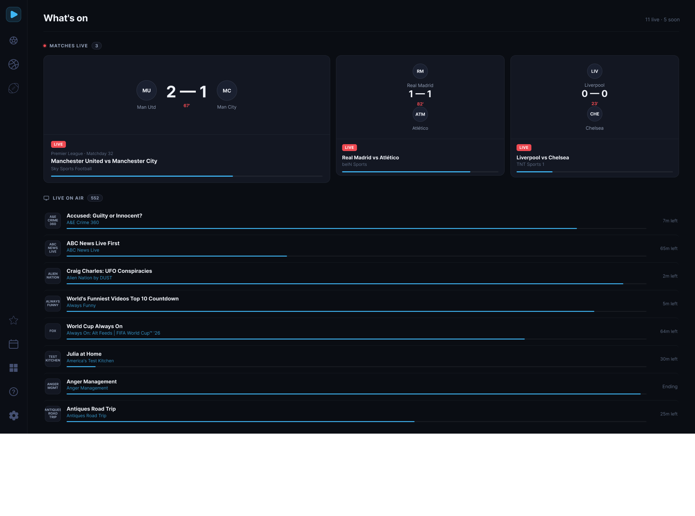
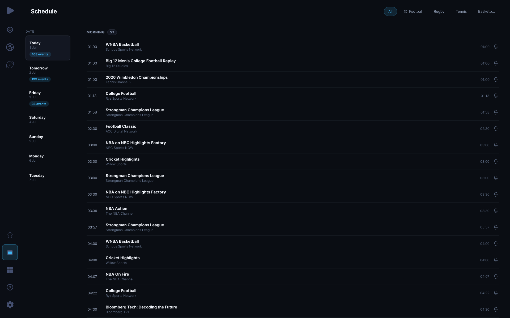
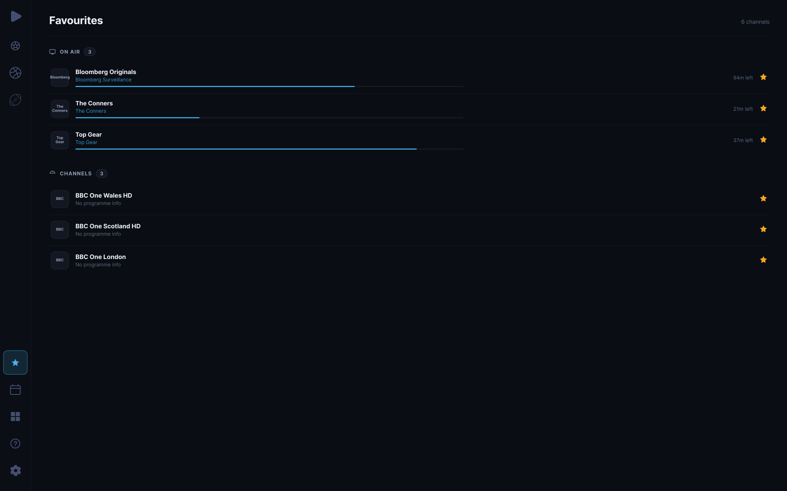
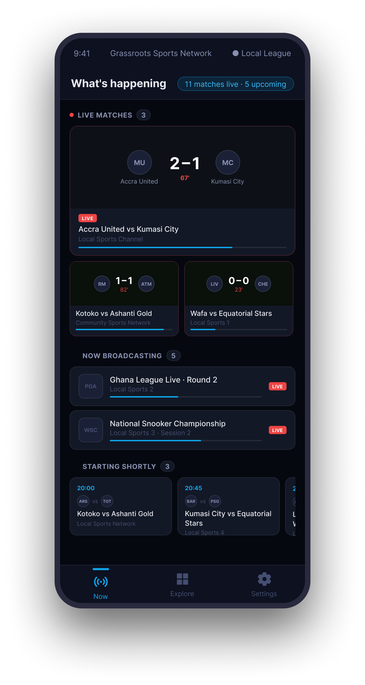
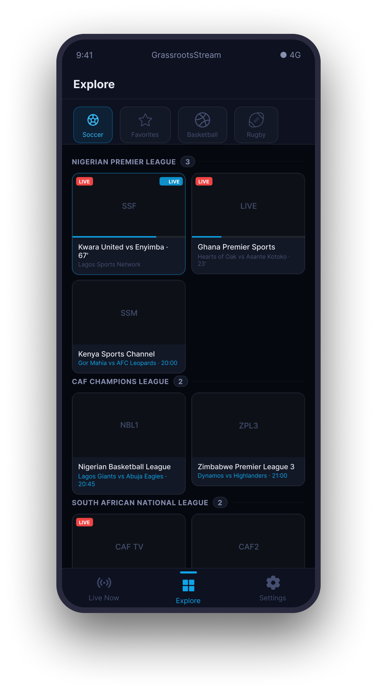
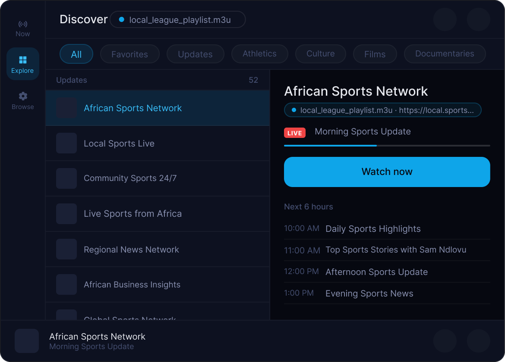

# NativeStream

[](https://github.com/fredrick-karuri/native-stream/actions/workflows/ci-server.yml)
[](https://github.com/fredrick-karuri/native-stream/actions/workflows/ci-macos.yml)
[](https://github.com/fredrick-karuri/native-stream/actions/workflows/ci-android.yml)
[](https://github.com/fredrick-karuri/native-stream/releases?q=server)
[](https://github.com/fredrick-karuri/native-stream/releases?q=android)
[](https://github.com/fredrick-karuri/native-stream/releases?q=macos)

**A native sports viewing platform that unifies fragmented sports content into a reliable experience across devices.**

NativeStream combines a content platform with native applications for Mac and Android. It manages content ingestion, stream reliability, metadata, and playback experience, allowing fans to enjoy sports seamlessly across their devices.

---

# The Problem

Sports content is fragmented across different sources, platforms, and devices. Fans frequently deal with unreliable streams, inconsistent playback experiences, missing schedules, and media players that were never designed around live sports.

| Challenge                     | Impact                                                             |
| ----------------------------- | ------------------------------------------------------------------ |
| Fragmented content ecosystems | Fans constantly switch between apps, links, and platforms          |
| Unreliable streams            | Streams fail, expire, or degrade during important moments          |
| Generic media players         | No sports context, schedules, live indicators, or match awareness  |
| Device fragmentation          | The experience differs across mobile, desktop, and TV environments |

---

# The Solution

NativeStream creates a unified sports viewing experience by separating the complexity of content delivery from the fan experience.

The platform handles:

* Content ingestion and organization
* Stream validation and reliability management
* Metadata and electronic programme guides (EPG)
* Cross-device synchronization and native playback experiences

---

# How It Works

```
                  Content Sources
                         │
                         ▼
              ┌─────────────────────┐
              │     NativeStream     │
              │                     │
              │ Content Ingestion   │
              │ Validation          │
              │ Stream Management   │
              │ Metadata & EPG      │
              │ Quality Selection   │
              └──────────┬──────────┘
                         │
          ┌──────────────┴──────────────┐
          ▼                             ▼
      Native macOS                  Native Android
   SwiftUI · AVFoundation        Compose · ExoPlayer
   PiP · AirPlay                 PiP · Chromecast
```

---

# Screenshots

### macOS

**Now** — live matches and what's currently on air


**Schedule** — full programme guide with date navigation


**Favourites** — pinned channels and programmes


### Mobile & Tablet

| Now (Android) | Explore (Android) | Explore (Tablet) |
|:---:|:---:|:---:|
|  |  |  |

---

# Features

## Content Platform

* Ingests and manages multiple content sources
* Monitors stream health and maintains reliable playback paths
* Automatically selects the best available streams based on quality and availability
* Provides metadata, schedules, and EPG information
* Exposes APIs for content management and client applications
* Can run locally, privately, or in cloud environments

## Native macOS Application

* Sports-focused channel browsing
* Live indicators and programme information
* Match Day experience with schedules and live events
* TV Guide with timeline navigation
* Full-screen player with native controls
* Picture-in-Picture
* AirPlay support
* Now Playing integration and media keys

## Native Android Application

* Mobile-first browsing experience
* Optimized landscape video player
* Picture-in-Picture support
* Chromecast support
* Shared content experience with the desktop application

---

# Platforms

Current platforms:

* macOS (SwiftUI + AVFoundation)
* Android (Kotlin + Jetpack Compose)

Future expansion:

* Smart TV experiences
* Additional connected devices

---

# Architecture

NativeStream is built around a modular architecture:

* Go-based content platform
* Native platform-specific clients
* Shared content and metadata model
* Standard streaming protocols and APIs

This design allows new clients and content sources to integrate without changing the overall user experience.

---

# Vision

Sports media is increasingly fragmented. NativeStream aims to provide a consistent layer between sports content and fans, enabling a richer, more accessible viewing experience regardless of where the content originates.

The architecture supports future opportunities such as curated content partnerships, specialized sports channels, and localized sports experiences.