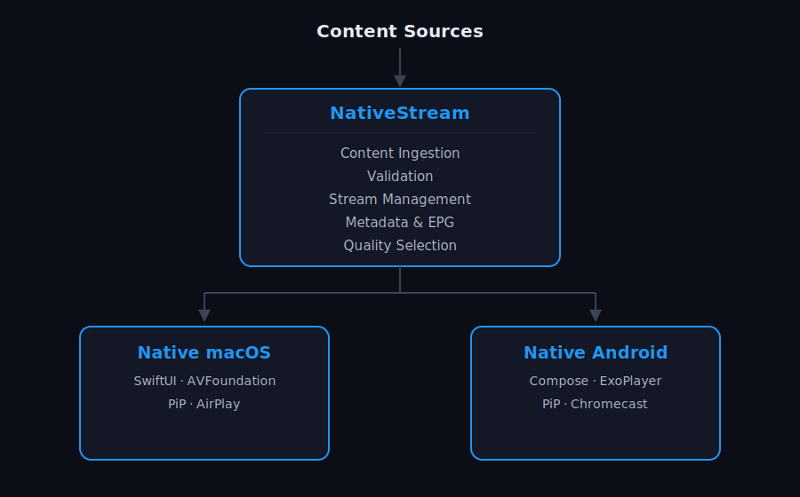

# NativeStream

**When you want to watch something live — play it. And if you can't, say why.**

NativeStream is a native live TV platform for Mac and Android. It manages stream reliability, EPG metadata, and playback experience so that when you tap a channel, it plays — and when it can't, you know exactly why.

---

# The Problem

Live TV fails quietly. Streams expire, degrade, or disappear mid-match with no explanation. Schedules are scattered across apps. The player has no sports context. And when something breaks, there's nothing to tell you whether it's the stream, your network, or the source.

| Challenge | Impact |
|-----------|--------|
| Streams that fail silently | You don't know if it's the source, the link, or your connection |
| Fragmented content | Constant switching between apps, links, and platforms |
| Generic media players | No live indicators, schedules, or match awareness |
| No cross-device continuity | Start on phone, can't continue on Mac without starting over |

---

# The Solution

NativeStream separates content delivery complexity from the viewing experience.

**The platform** continuously validates stream health, selects the best available path, and maintains EPG metadata — so the app always knows what's on and whether it's playable.

**The clients** surface that intelligence as a native experience: live indicators, match schedules, stream health, and clear feedback when something isn't working and why.

---

# How It Works

---

# Screenshots

### macOS

**Now** — live matches and what's currently on air

**Schedule** — full programme guide with date navigation

**Favourites** — pinned channels and programmes

### Mobile & Tablet

| Now (Android) | Explore (Android) | Explore (Tablet) |
|:---:|:---:|:---:|
|  |  |  |

---

# Features

## Content Platform

* Continuously validates stream health across all sources
* Automatically selects the best available stream path
* Detects and surfaces why a stream is unavailable — dead link, source down, or network issue
* Maintains EPG schedules and live programme metadata
* Exposes APIs for content management and client applications
* Runs locally, privately, or in cloud environments

## Native macOS Application

* Sports-focused channel browsing with live indicators
* Match Day experience with schedules and live events
* TV Guide with timeline navigation
* Full-screen player with native controls
* Picture-in-Picture and AirPlay
* Now Playing integration and media keys
* Local Media Connect — send and pull back streams between devices

## Native Android Application

* Mobile-first browsing with live and upcoming sections
* Optimized landscape video player
* Picture-in-Picture and Chromecast support
* Offline mode — cached content with clear network status
* Local Media Connect — control Mac playback from your phone
* Video quality cap for low-bandwidth connections

---

# Local Media Connect

NativeStream devices on the same network can hand off playback between them.

* Push what you're watching on your phone to the Mac
* Pull it back to your phone at any time
* Control Mac volume and playback from the Android remote
* The app tells you when devices are available and when they're not

---

# Platforms

Current:

* macOS (SwiftUI + AVFoundation)
* Android (Kotlin + Jetpack Compose + Media3)

Future:

* Smart TV
* Additional connected devices

---

# Architecture

* Go-based content platform with stream health monitoring
* Native platform-specific clients
* Shared content and metadata model via standard streaming protocols
* WebSocket control plane for cross-device coordination

---

# Vision

Live TV should just work. When it can't, it should tell you why — not leave you guessing whether to refresh, switch sources, or check your connection. NativeStream is built around that contract: play it, or explain why you can't.